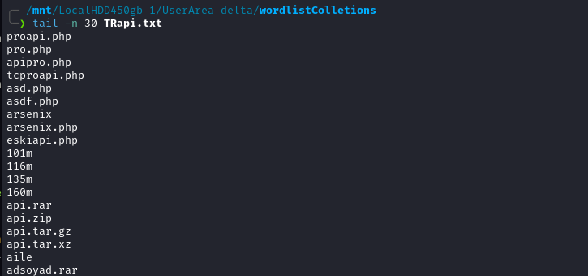

# Türkce Web Dizin Listesi 

Türkçe dil kullanan legal & illegal web siteleri için web üzerindeki kaynak kodların incelenmesi ile oluşturulan bir wordlist projesidir. Özellikle illegal web sitelerini tespit etmek için kullanmış oldukları api ve dosya yolları eklenmiştir.

 

## Nasıl Oluşturuldu?

Telegram üzerinden pek çok halka açık veya gizli grup üzerinden paylaşılan sahte ve/veya orjinal web sayfalarına ait kaynak kodların incelenmesi ile elde edilmiştir.

 

## Örnek: 

 

